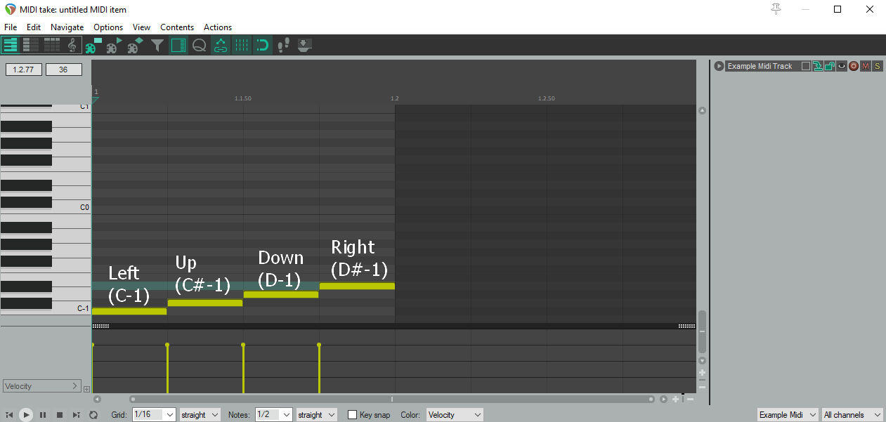

# Disco Queen Dancing FeVR: Custom Song Guide

# Overview

Custom songs are placed in a subdirectory of the folder containing the game executable. Place your custom song directories in `./Disco Queen Dancing FeVR_Data/StreamingAssets/songs/`. Each custom song exists in its own directory.

<p align="center">
    
</p>

Each custom song must have the following items:
	- A .ogg audio file, which is the song's BGM
	- A metadata .json file
	- One or more .midi files (typically one per difficulty, although you may be able to bundle each difficulty into a single midi file)

An example of some functional custom songs can be found [here](./Assets/StreamingAssets/songs/).

# Authoring Charts

## Creating Charts

Song charts are simple MIDI files, that can be created using any DAW (Digital Audio Workspace). I use [Reaper](https://www.reaper.fm/), which is free to use for 60 days (but I think you're still technically to use it after the 60 days are up, even though you're in violation of the license?). This guide will use Reaper as a reference, but functionally it should work the same regardless of what DAW you use.

To start, open up a new project in Reaper. Drag and drop your audio file in - it should create a new track for the audio. 

Now we need to adjust the BPM of the project to match the BPM of the song. Before we do that, we need to change a setting on the audio clip so that changes to the project's BPM do not affect the playback rate of the song. Right click the audio clip, and under "Item Settings", enable "Set item timebase to time".

<p align="center">
    
</p>

You can now tweak the BPM of the project to match the tempo of the audio track, using the "BPM" box on the bottom right of the project window. 

Now, create a new track (Track -> Insert new Track), and insert a new MIDI item (Insert -> New Midi Item). Give the new MIDI track a name, something like "Hard Difficulty", by double clicking on the track name (the black bar next to the red button with a circle in it).

<p align="center">
    
</p>

Double click on the newly created MIDI item to open up the MIDI editor for this item. Scroll down to the bottom. The bottom 4 notes correspond to the 4 input directions.

|MIDI Note|In-game note direction|
| ---| --- |
|C-1|Left|
|C#-1|Up|
|D-1|Down|
|D#-1|Right|

<p align="center">
    
</p>

Currently (v1.0.1), the length of the MIDI note has no effect. It is only when the MIDI note begins, that determines when a note will spawn in-game.

One thing to keep in mind when authoring charts is that there is currently an issue I've noticed with smflite: For some reason, if you place a MIDI note at time 0:00 (like in the screenshot above), the note won't be read in-game. As a workaround, you can move the whole MIDI track to the right, so that the first MIDI note of the song occurs later (eg: a whole measure later). If you do this, make sure to re-export the song to include this extra delay, otherwise the song and the MIDI chart will be out of sync.

## Exporting Charts

Once your chart is ready to be exported, you can export the MIDI track. First, select the track containing your MIDI items, then select "File -> Export project MIDI". My settings are listed below.

<p align="center">
    
</p>

You'll need to do this for each difficulty that you want to support, for this song. 

Optional: If you adjusted the song to add a delay to fix the bug causing MIDI notes to not spawn at time 0:00, make sure to also render the audio file, so that the audio file also has the newly-added delay. This can be done via "File -> Render", exporting as an "OGG Vorbis" file.

<p align="center">
    
</p>


## Editing the metadata file

Once your audio file and exported MIDI charts are ready, place them in a new directory under `./Disco Queen Dancing FeVR_Data/StreamingAssets/songs/`. Copy/paste a metadata file from another song's directory ([or grab one from the git repo](./Assets/StreamingAssets/songs/clement-panchout_sweet-70s/metadata.json)) to get a nice template to start from.

The important changes to make are:

- Set the name of the song, and the author of the song
- Set the BPM to match the BPM of the song (and of the Reaper project)
- Update the reference to the filename of the audio file
- For each difficulty, update the filename of the exported MIDI chart

Once this is complete, you should be able to run the game and see your song in the song list menu! If not, then there's probably a mistake in either the song directory or in the metadata file. In that case, take a look at the section below for troubleshooting tips.

# Song Validation

When preparing to render the song list menu, the game loads all of the songs' metadata files from the filesystem into memory. During this step, there is some validation that is performed. If validation fails, the song will not be loaded into memory, and a log detailing the errors will be printed to the Player Log. This log will be overwritten every time that that the game is run.

|Operating System|Player Log Location|
| --- | --- |
|Windows|%USERPROFILE%\AppData\LocalLow\Made by Request\Disco Queen Dancing FeVR\Player.log|
|Linux|~/.config/unity3d/Made\ by\ Request/Disco\ Queen\ Dancing\ FeVR/Player.log|
|MacOS|~/Library/Logs/Made\ by\ Request/Disco\ Queen\ Dancing\ FeVR/Player.log|

There's a lot of irrelevant stuff in this file, so you'd want to search for "Invalid metadata" to jump to the important part. An example excerpt from the log is below - in this case, the metadata file is pointing to an audio file that doesn't exist, and to a midi file that doesn't exist. If you're running into issues loading your song, try fix each of the errors listed for your song in the logs, and it should fix the issue.

```
Invalid metadata file [Miami Soul] at [D:\My Files\documents\unity\disco-queen_dancing-fevr\Builds\disco-queen_dancing-fever_v-1-0-1\Disco Queen Dancing FeVR_Data\StreamingAssets\songs\neocrey_miami-soul]:
Difficulty [Medium] is missing a midi track (File [D:\My Files\documents\unity\disco-queen_dancing-fevr\Builds\disco-queen_dancing-fever_v-1-0-1\Disco Queen Dancing FeVR_Data\StreamingAssets\songs\neocrey_miami-soul/non-existant-midi-file.mid] doesn't exist)
No audio file exist for this song at [D:\My Files\documents\unity\disco-queen_dancing-fevr\Builds\disco-queen_dancing-fever_v-1-0-1\Disco Queen Dancing FeVR_Data\StreamingAssets\songs\neocrey_miami-soul/non-existant-audio.ogg].
```

The validation function can be found [here](./Assets/Scripts/songs/menu/song%20menu/SongLoader.cs#L85). A non-exhaustive list of common issues is below:

* The metadata file must exist
* There must be at least 1 difficulty for the song
* There must be a .ogg audio file (with a .ogg file extension)
* There must be at least 1 MIDI file. 
	* It may be possible (untested) to store each difficulty's chart data in a separate MIDI track in a single MIDI file, rather than split it up into different files. 
	* At the very least, each difficulty must have a reference to a MIDI file.
* If you for some reason have multiple copies of the game on your PC, make sure that the custom song exists in that game's data folder!

For future-proofing reasons, the gamemode must currently be "classic", and the version must be "1.0".
