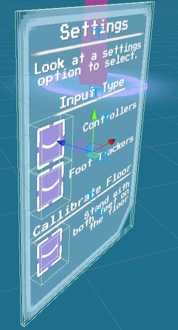
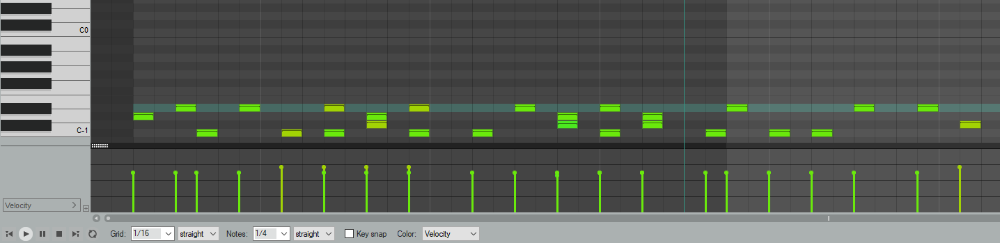

# Disco Queen Dancing FeVR: Postmortem


## About This Game

My goals for this game were to make something simple using OpenXR and Unity's XR Interaction Toolkit; and to make a project that uses Vive/Tundra Trackers. I bought mine a while ago, and hadn't found time to develop anything using for them yet, so this has been high on my TODO list. A Dance Dance Revolution clone had been on my mind for a while, since it seemed like a small enough project that could be made over the short scale of a game jam. 

Having custom song support was also something that I was interested in - something similar to how Paradiddle does it. I borrowed a lot of that game's structure, when planning how to package each custom song.


## Topics of Interest

The main topics that are worth discussing are supporting feet trackers, using MIDI for song charts, and custom song support.

Less interesting but still neat things that are also worth discussing are the gaze menus, and event channels!


### Vive/Tundra Tracker Support

One of the main reasons I used this project specifically to try out OpenXR was for Vive/Tundra Tracker support. This project was made with OpenXR 1.4.2, and the XR Interaction Toolkit 2.0.2 - but I was surprised to find that trackers were still not yet officially supported. I had to download an OpenXR profile off of the [Unity forums](https://forum.unity.com/threads/openxr-and-openvr-together.1113136/#post-7803057), which ended up being pretty plug-and-play. The lack of officially-supported features from the SteamVR plugin is the big thing that keeps me back from fully switching to OpenXR (Valve Knuckle finger tracking soon please!), but so far I'm enjoying what I've seen.

Once I had trackers working, there was a handful of things I had to consider from a design standpoint. The first was that I wanted to make sure that the game was fully playable using either trackers, or standard controllers. My solution was to create a separate gameobject for each foot, and have that follow the active controller - whether that be a standard controller, or a Vive/Tundra tracker. The player can switch between using the controller, or trackers, via the settings menu. Making controller/tracker input work identically, regardless of what input method the player was using, made testing really easy.

As an input method, this foot gameobject interacts with the floor buttons via simple trigger colliders. Of course, since the feet need to touch the floor to interact with these colliders, so I added a calibration option that moved the floor up to match the height of the lowest tracker. As a next step, I think this calibration step could use a redesign - I noticed that sometimes I could miss some steps, if one of my trackers was positioned slightly higher on one foot. The simple solution would be to move the floor to the height of the highest tracker, or the average height of the two trackers. 

### Gaze UI Menus

Another design issue that I faced is in user-input, which I solved via Gaze UI Menus. This was necessary to implement, since I couldn't rely on the user being able to use their controllers for input, if they were strapped to their feet!

Because a valid option to play was to strap your regular controllers to your feet, I couldn't assume that the player could press any buttons for input. I decided to go with traditional gaze-selection. Each of my menus had a thin collider spanning the size of the whole menu, as well as each of the gaze-able buttons. I raycasted forward from the player's camera, and considered a button "hovered" if the raycast hit a gaze-able button's collider. On each frame that a button was hovered, I updated a timer for that button, decreasing that same timer otherwise. Once that timer reached a high enough value, the button was considered "clicked", and a UnityEvent would be invoked. 

<p align="center">
	
</p>

This setup for buttons proved to be super reusable, and was helpful in any case where I needed input, but it wasn't easy/convinient/possible to rely on using the floor buttons for input. One big example is right after the title sequence - the floor hasn't been calibrated to the player's feet height, and so there'd be no way for the player to initiate the calibration sequence! Another big example is during gameplay of the song, where the player would be busy using the floor buttons for hitting notes.

For juice, I added an icon that would lerp to follow the player's gaze. On each frame that the player looked at a gaze-able menu or a gaze-able button, I pass in the world position of where the player's raycasted gaze collided with the menu. If the player looked at a button, I instead passed in the position of the button, rather than the position of the raycast collision. This added a snapping mechanism to the gaze, which I thought was super satisfying. 

I also lerped the background color of the gaze-able buttons based on how long the player had been looking at the button. This proved to be necessary, because it wasn't otherwise clear how long you had to look at a button before it was selected. Changing the icon of the button on selection also helped to make the "on selection" event more obvious. Once I started adding these tweaks, I made sure to add one to the title screen, just to make sure that the player knew how to interact with them.

Overall I'm very satisfied with the gaze UI system. It was really reusable across different contexts, and tweaking the button to handle different use-cases (deselect automatically on unhover, deselect automatically on game state change, force selection/deselection without firing events for initialization purposes) ended up being pretty simple to add on later.

In terms of next steps, I think there would be some use-cases where more UI options like sliders would be nice to add (for tweaking sfx/bgm volume). Finding a good setup for making that work smoothly with gaze-able selection may need some testing. Maybe something along the lines of, gaze at a menu slider to start selection, drag your gaze across the slider to select a value on the slider, then lower your gaze onto a confirmation button to commit your change.


### Song Charts using MIDI

A challenge I had going into this project was about how to create the song charts. I really didn't want to have to create my own tool for this, because I really didn't have enough time to make something functional, polished, and tested. I decided to look into how other rhythm-based games did it, starting with Guitar Hero clones, and I stumbled onto [this super informative post about the history of custom Guitar Hero chart formats by Reddit Dot Com user /u/mikex5](https://www.reddit.com/r/CloneHero/comments/8bkb0n/a_brief_history_of_custom_guitar_hero_chart/). The TL;DR is that .midi files were popular which could be made with standard MIDI editors like Reaper, but .chart files were also popular due to an open-source chart editor that could export to human-readable files. I decided to stick to .midi files, since I was already comfortable with working with MIDI tracks in Reaper, and because I found a [small and powerful MIDI reader for Unity (smflite)](https://github.com/keijiro/smflite) that worked perfectly. Given more time, I'd have liked to explore .chart files as an alternative, but .midi files checked all of my requirements right from the beginning. It's possible that it's not the best tool for the job, but it was the tool that did everything I needed, and easily.

Smflite can read as many MIDI tracks as needed, by returning a list of MidiEvents that occur between the some time T, and the elapsed time since the last check. It's recommended that you check for midi events each frame, passing in Time.deltaTime. 

```c#
void Update() {
	if(sequencer.Playing) {
		List<Midievent> events = sequencer.Advance(Time.deltaTime);

		if(events != null) {
			foreach(MidiEvent e in events) {
				// Process each MIDI event since the last frame
			}
		}
	}
}
```

These MIDI Events come with a status field, and 2 byte fields of data. The status field can be looked up in a [status chart](https://www.midi.org/specifications-old/item/table-2-expanded-messages-list-status-bytes), but the 2 statuses that I was able to capture are "Note On" events and "Note Off" events - with data fields storing note pitch and note velocity.

In the midi file, I had 128 notes at my disposal, about 9.5 octaves. I used the lowest 4 notes (C-1 to D#-1) to store info about when to spawn notes in-game, spawning a note on each "Note On" event. This leaves 124 notes open for future-proofed options, like other game modes.

<p align="center">
	
</p>

As a next step here, there were a few things that I wanted to do with the midi files: 

- Play in-scene animations via the .midi file (likely a separate midi track in the same file). 
	* For example, a specific light could turn on when the MIDI file has a sustained C1 note. Particles could spawn from a specific location when the MIDI file has a D2 note just starting. 
	* Since each MIDI event stores 2 bytes variables worth of data, I figured I could add some parameters to the MIDI input (eg: turn a specific light on, but to an intensity ranging from 0-1, depending on the velocity of the MIDI note).
- Sustained notes, that the user would have to hold a button down for. The player would get more points the longer they hold the note for.
- Using a long MIDI note, define a section the song. Upon hitting all of the notes in this section, the user would be awarded bonus points, and would played a custom SFX (per-song customizable, defaulting to some crowd cheering SFX)

### Custom Song Support

I decided early on to support custom songs, and so I built the entire infrastructure of loading/playing songs around the assumption that every song (included with the game, or user-generated) comes from the same place. This all ended up being pretty simple - I just created a directory in `./Assets/StreamingAssets/`, and had each custom song exist in its own subdirectory. In each song directory, I expect there to be the following items:

- An audio file, for the BGM
- For each song difficulty, a .midi file containing the chart. 
  * As an aside, I'm pretty sure you could just have 1 midi file, and encode the chart data in a different MIDI track. You would just then point the metadata file 
- A .json metadata file, storing references to the above files, and details about the song (song name, artist name, bpm, etc)

An example of a metadata file can be found [here](./Assets/StreamingAssets/songs/neocrey_miami-soul/metadata.json).


One issue I did have, was in loading audio files from the filesystem. I figured that loading .ogg, .mp3, and .wav files would all work the same - but for some reason only .ogg files would load properly. If I recall correctly, the function to load files from the filesystem would work without throwing an error, but I would be left with a null audio clip. Since .ogg files worked as expected, I decided to just use those. Adding support for .wav and .mp3 files should be an easy enough bug-fix ([1](https://answers.unity.com/questions/737002/wav-byte-to-audioclip.html), [2](https://forum.unity.com/threads/loading-wav-files-into-an-audioclip-without-using-www-or-resources-load.409829/)), but it's just something I didn't have time for. I recall seeing that .ogg and .wav files are recommended for looping audio ([something about a delay before playing .mp3 files](https://answers.unity.com/questions/343057/how-do-i-make-unity-seamlessly-loop-my-background.html)), so sticking to .ogg and .wav would be best, to avoid the BGM and the MIDI chart getting out of sync.

Aside from having issues loading the audio files from the filesystem, the workflow I had worked very well. 


### Event Channels

Event channels aren't new to my game, but I tried to rely heavily on them for this one in particular. I tried to make the game as modular as possible, so that adding new features added little churn to existing parts. 

I used event channels heavily in terms of game state - I had a singleton component that would store the current game state, but any requests to change the game state went through an event channel. Updates to the game state would also be relayed through the event channel. This way all of my components had a reliable way to change the game state, and to listen for changes to the game state from other components, without having to do anything weird or inefficient, like check the singleton every frame.

One thing was really helpful, was using Odin Inspector to quickly append custom buttons to the inspector for Event Channel instances. This way, I could quickly invoke methods in the event channel, without having to go through the intended ways of triggering the event channel. For example, this meant that I didn't have to wait for the title screen sequence to play, to be able to jump to the main menu game state.

## Next Steps

This is a handful of things that I wanted to add at some point.


### Other Game Modes, Yakuza Mode

When planning this game, I knew that I wanted something DDR-related, but I was also considering making gameplay similar to Yakuza 0's disco mini game. I added a string in the metadata file to store game mode information (currently the only valid value is "classic"), but I figured that if I were to continue working on this, Yakuza mode would be the next step. There would be a larger floor with more buttons, and the player would get more points by stepping on any of the buttons on their path to hit the oncoming note. I ultimately scrapped this idea in favor of traditional DDR gameplay, because I was worried about constraints about playspace size. If I were to work on this in the future, I'd consider adding an option to scale the player's virtual floor in the xz directions. Some care would be needed when changing the floor size, since the player would likely be used to the [default size, which is scaled to match tranditional DDR arcade machines](http://mirrors.arcadecontrols.com/ddrhomepad/www.angelfire.com/d20/ddrhomepad/ddrdimensions.html).

Other game modes that could be added would likely be to add more floor buttons - likely a 8-directional input mode, or a mode that uses 2x4 directional input mode (using both floor inputs from player 1, and from player 2).

### Custom shoe models

While planning this game, I thought it'd be fun to have a bunch of low-poly shoe models that the player could choose from (high platform shoes, high heels, etc). I ultimately scrapped this after planning, because I realized that it wasn't obvious where on the player's feet the trackers were. This caused issues, because I needed it to be clear to the player where their colliders were, relative to their trackers. Introducing a custom model, and removing the spheres that are a 1-to-1 match of the collider's bounds, introduces some uncertainty and frustration. "I touched the floor with my virtual feet, why didn't the input happen?"

I think that this is a very solve-able problem, just one that needs a little bit of tweaking to get right. I think I would, in the future, try to adopt a calibration method similar to how Blade & Sorcery does it, where the player has to align their meat-feet to align with their virtual-feet. This would mean that I could add custom colliders to more closely match the shape of the player's feet, meaning that input would be more accurate overall. You could get even more precise with colliders, if you asked the player what their shoe size was, scaling the feet colliders to match that shoe size!


### Object Pooling

This is relatively simple to add, but I just didn't have time. The notes that spawn during a song all are instantiated and destroyed, rather than being object pooled. This is a pretty lightweight game, so it's not a huge issue - but if I need performance in the future, this is something I could change.


### High Scores

High scores was something I cut from development due to a lack of time and energy. I hesitated here because I wasn't sure how best to store the high scores. Do I store them in player prefs? What would be the unique key for each song, since I allow for custom songs? Do I need to add a field for a user-generated unique key in the metadata file, or can I just create one using the song and artist name? Would that cause issues, if there were duplicates of the same song, or if the player renamed the song directory? Maybe then, I should store high score data in the custom song's directory! I'd like to avoid writing to the metadata file, just to ensure I don't accidentally mess up that file during the write process. Should there be some kind of read-only system, so that they player can't (easily) manually overwrite the high score data?

Reflecting on it now, I think the best solution forward would be to store high score data in the custom song folder, in a separate file. This could be a json file, but if I want to try to stop the player from manually modifying their high score data, I could write it in binary. Maybe encrypt it with a per-user key or something. That's probably much more overkill than what's necessary.

There's also the possibility of storing high score data on a custom server, which is [free and easy](https://www.youtube.com/watch?v=YoGnxoJR_s4&list=PLZpDYt0cyiusT185fsSTEU1ecr8CcTYMP&index=40), although this website likely isn't scalable to a per-song basis.

### Note Board: Render Song Measures

Right now, only midi notes are spawned from the note board. It'd be nice to have a setup similar to Guitar Hero or Paradiddle, where you would spawn thin lines to indicate the beat of the song. This could be derived from the bpm of the song, but you'd also have to encode the time signature into the song metadata. This also could prove problematic for songs with time signature changes - this implies that I'd have to ALSO encode time signature changes into the chart MIDI data. While we're at it, we might as well also need to encode BPM changes into the chart MIDI data, for cases where the song speeds up or slows down! This is a whole thing, which is why it got cut.

### Custom chart file improvements

I rolled my own solution for the format of chart files (just using the lowest 4 midi notes in a MIDI file), but I re-doing it to support custom songs from other DDR clones would be nice. It'd be really cool to just copy/paste custom songs from StepMania, and be able to play those songs in VR. I think that if I were to make this a more feature-complete game, I'd have to look into other charting formats, primarially to have support for existing DDR songs, but also to easily add support for time signature / BPM changes. The latter, again, is likely very do-able (either in the metadata file, or in the MIDI file), but I'd want to look into the other charting options just to be sure I'm not making things too hard or complex for chart makers.
